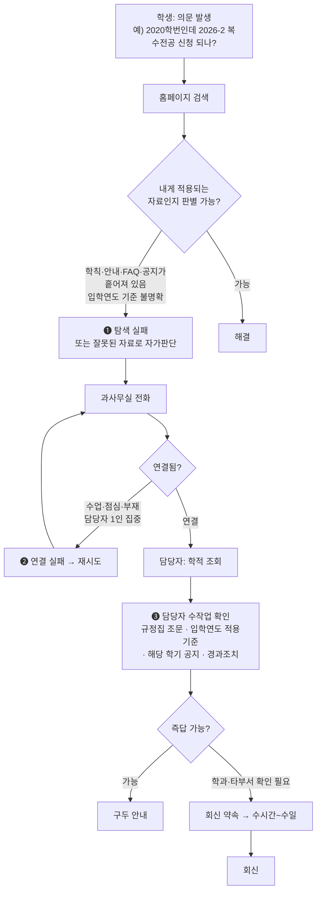
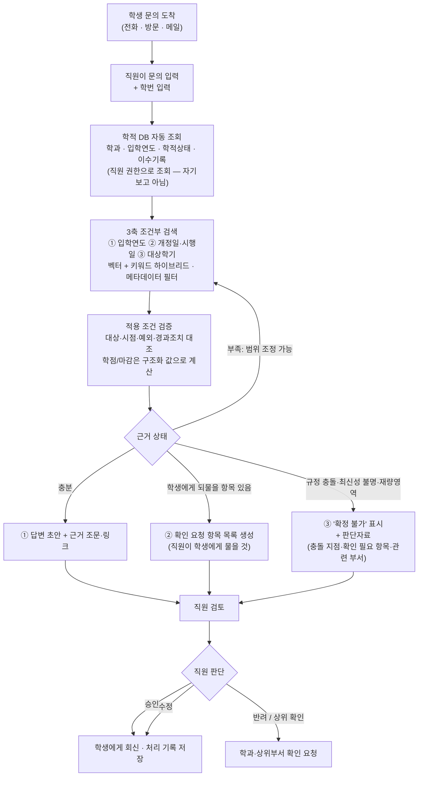

# Workflow 정의 — AI 적용 전(as-is) / 적용 후(to-be)

- 작성일: 2026-10-02 / 작성: 신기훈
- 근거: 노현선 2026-10-02 14:37 슬랙 발화 + `이화여대_학사자료_DB수집_정리.pdf` §6
- 과제 요건: Category G "Workflow 정의 (AI 적용 전 workflow / 적용 후 workflow 비교)"
- **사용자 확정 (2026-10-02 14:59)**: 이 시스템의 사용자는 **학생이 아니라 행정실·과사 직원**이다.
  → 학생은 여전히 문의의 출발점이지만, 시스템에 접속하는 주체는 직원이다. 자세한 영향은 `06_사용자정의_직원용시스템.md`

> 현선님 원 발화:
> "뭔가 궁금한 사항 생김 → 과사에 전화해야 함 → 전화연결도 어렵고 담당자도 확인해봐야 함
>  이 과정이 좀 번거로워서 아예 학교 홈피에 챗봇이든 페이지든 하는 형식으로 에이전트를 넣는 거죠"

이 한 문장에 **병목이 셋** 들어 있다. 이 문서는 그걸 펼친 것이다.

---

## 1. As-Is — AI 적용 전

### 1-1. 흐름

### 1-2. 병목 3개와 비용

| # | 병목 | 누구의 비용 | 성격 |
|---|---|---|---|
| ❶ | 자료가 흩어져 있고 **적용 대상이 표기되지 않음** | 학생 | 탐색 시간 + **오판 위험** |
| ❷ | 전화 창구 단일 · 시간대 제약 | 학생 | 대기 시간 |
| ❸ | 담당자가 매번 규정·공지·경과조치를 **수작업 대조** | 담당자 | 반복 노동, 문의가 몰리면 선형 증가 |

❶이 중요한 이유: 실패하면 ❷로 넘어가 **담당자 부담으로 전가**된다.
즉 학생의 탐색 실패율과 과사의 업무량은 같은 지표의 앞뒤다.

### 1-3. 왜 단순 검색/FAQ로는 ❶이 안 풀리나
동일 질문의 정답이 **학생 속성과 시점**에 따라 갈리기 때문이다.
- 프로필 의존 — hoBIT(arXiv:2608.26604)이 실증
- 시점 의존 — 법률 RAG에서 *temporal misgrounding* 으로 보고. 정적 코퍼스 RAG가 날짜상 적용되는 조문을 검색한 비율 **0%** (arXiv:2608.09393, 수치 재확인 예정)

---

## 2. To-Be — AI 적용 후

### 2-1. 흐름

**핵심: 마지막 결정권은 항상 직원에게 있다.** 시스템은 어떤 경우에도 학생에게 직접 회신하지 않는다.

### 2-2. 병목이 어떻게 해소되는가

| 병목 | 해소 방식 |
|---|---|
| ❶ 탐색 실패 | **직접 해소되지 않는다.** 학생은 여전히 전화한다. 다만 ❸이 빨라지면 통화 1건당 처리시간이 줄어 간접 완화 |
| ❷ 연결 실패 | **직접 해소되지 않는다.** 단, ❸ 단축 → 통화 회전율 상승 → 대기 감소 |
| ❸ 담당자 수작업 | **여기가 주 타깃.** 규정·공지·경과조치 대조를 시스템이 수행하고, 직원은 **검토·판단**만 한다 |

> **솔직하게 적어둘 것**: 사용자를 직원으로 한정하면 ❶❷는 직접 풀리지 않는다.
> 발표에서 "학생 대기시간이 줄어듭니다"라고 단정하면 반박당한다.
> **"직원 1건 처리시간 단축 → 간접 효과"** 로 정확히 말하는 편이 안전하고, 측정도 가능하다.

### 2-3. 설계 원칙 (정리본 §4 반영)
- 벡터 유사도가 높다는 이유만으로 **규정 적용이나 졸업 가능 여부를 확정하지 않는다**
- 자료에 적용 연도가 없으면 **'확인 필요'** 로 저장하고, 게시일을 시행일로 대신 쓰지 않는다
- 충돌하는 자료는 **최신 게시물이라는 이유만으로 자동 선택하지 않는다**
- 시스템은 **보조 도구**이며 구속력 있는 판단은 공식 규정과 담당자에게 있다

---

## 3. 전/후 비교표 (발표용)

| 구분 | As-Is | To-Be |
|---|---|---|
| 진입점 | 홈페이지 검색 → 실패 시 전화 | 단일 대화 창구 |
| 적용 대상 판별 | 학생이 직접, 근거 불명확 | 학적 DB 조회 + 메타데이터 필터 |
| 시점 판별 | 담당자 수작업 또는 누락 | 개정일·시행일·대상학기 3축 자동 대조 |
| 응답 시간 | 수십 분 ~ 수일 | 즉시 (이관 건은 담당자 처리시간 단축) |
| 근거 제시 | 구두, 추적 불가 | 원문 링크·조문 단위 인용 |
| 불확실할 때 | 담당자 재확인 (맨땅) | **판단자료 첨부 후 이관** |
| 담당자 업무 | 모든 문의 1:1 대응 | 단순 반복 건 자동화, 판단 건에 집중 |
| 기록 | 남지 않음 | 실행 이력·처리 상태 축적 → 다음 개선 근거 |

---

## 4. 측정 — "비교"를 숫자로 만들려면

**주의: 실제 이대 과사 업무 데이터는 확보할 수 없다.** 따라서 아래는 ①시스템에서 직접 측정 가능한 것과 ②가정을 명시한 추정치로 나눈다.

### 4-1. 직접 측정 (평가셋으로 산출 — 04 문서)
| 지표 | 정의 |
|---|---|
| 적용버전 정확도 | 날짜·학번상 **적용되는** 근거를 검색했는가 (strict) |
| Faithfulness | 답변 주장이 검색 근거로 뒷받침되는가 |
| Context Precision / Recall | 검색 품질 |
| **적절 이관율** | 근거 불충분한 질문을 답하지 않고 이관했는가 |
| **과잉 이관율** | 답할 수 있는데 이관해버린 비율 |
| 평균 역질문 수 | 사용자 부담 |

### 4-2. 추정 (가정 명시 필수)
| 지표 | As-Is 추정 | 산출 근거 |
|---|---|---|
| 1건당 학생 소요 | 탐색 N분 + 통화대기 M분 | **팀 자체 측정**: 평가셋 질문 중 5건을 직접 홈페이지에서 찾아보고 시간 기록 |
| 1건당 담당자 소요 | — | 동일 5건을 사람이 규정 대조로 푸는 시간 기록 |

> 이 자체 측정은 데이터 없이 **오늘 바로** 가능하고, 발표에서 가장 설득력 있는 슬라이드가 된다.
> "우리가 직접 해봤더니 한 건에 X분 걸렸고, 그중 Y건은 결국 못 찾았다."

---

## 5. 시연 시나리오 (정리본 §6과 동일)
1. **근거 충분** → 출처 달아 초안 작성
2. **학생 정보 부족** → 필요한 필드만 추가 질문 후 해결
3. **규정 적용·예외 불명확** → 담당자 이관 + 판단자료

UI에는 `학생 조건 확인` / `해당 연도 자료 검색` / `학기 공지 확인` / `적용 조건 검증` 같은 **실제 실행 기록과 출처**를 노출한다.

> **구현 형태 (2026-10-02 팀 합의)**: React + FastAPI 웹앱.
> UI의 평가 포인트는 화면의 화려함이 아니라 **"무엇을 보고 그렇게 답했는가"의 가시화**다.
> 따라서 화면 설계의 1순위는 답변 말풍선이 아니라 **실행 기록 패널(Trace)과 근거 문서 패널**이다.
> 특히 시연 ③(담당자 이관)은 챗 UI만으로는 보여줄 수 없으므로 **담당자 큐 화면**이 별도로 필요하다.
